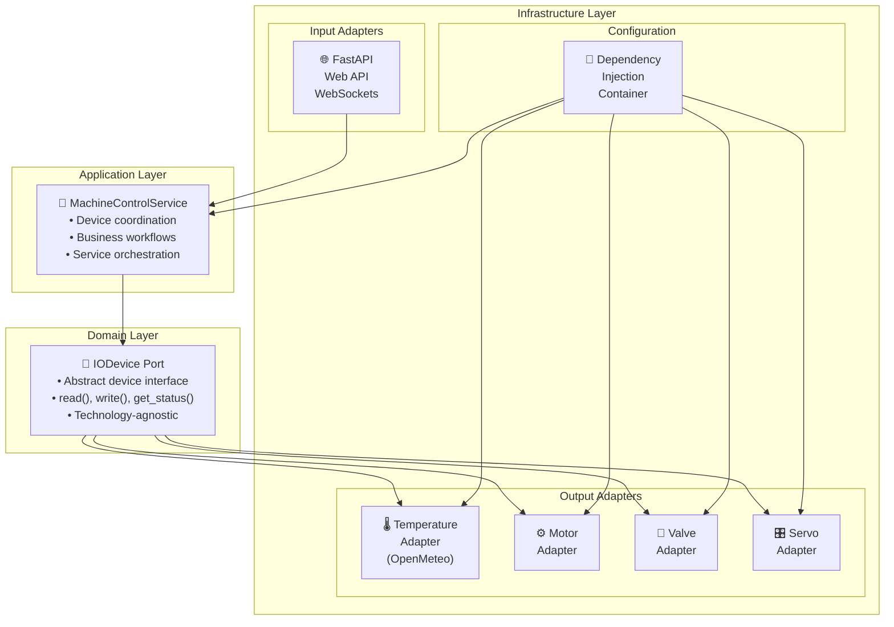

# Machine Control Panel

[](https://python.org)
[](https://python-poetry.org/)
[](https://reactjs.org/)
[](https://www.typescriptlang.org/)
[](https://alistair.cockburn.us/hexagonal-architecture/)

A modern full-stack device control system with real-time monitoring and control of industrial devices. Built with Python FastAPI backend and React TypeScript frontend, featuring WebSocket communication and responsive design.

## 🚀 Project Overview

The Machine Control Panel is a full-stack industrial IoT system with real-time device monitoring and control capabilities. It features a Python FastAPI backend with hexagonal architecture and a modern React TypeScript frontend.

**Backend Features:**
- **Real-time monitoring** of temperature, motor speed, valve states, and servo positions
- **Device control** through standardized REST API interfaces  
- **WebSocket streaming** for real-time data updates
- **External API integration** with OpenMeteo for environmental data
- **Scalable architecture** using dependency injection and hexagonal design

**Frontend Features:**
- **Responsive dashboard** built with React 18 and TypeScript 5
- **Real-time UI updates** via WebSocket connections
- **Device-specific controls** with validation and error handling
- **Modern design system** using Tailwind CSS
- **State management** with Zustand for predictable updates

### Key Features

- 🌡️ **Temperature Monitoring**: Real-time environmental data via OpenMeteo API
- ⚙️ **Motor Control**: Speed management with realistic simulation
- 🔧 **Valve Management**: Binary state control (open/closed)
- 🎛️ **Servo Control**: Precise position control (0-180°)
- 📡 **WebSocket Streaming**: Real-time data updates with configurable intervals
- 🔌 **REST API**: Device configuration and control endpoints

## 🏗️ Architecture

This project implements a **Simplified Hexagonal Architecture** with clear separation of concerns:



### Layer Responsibilities

- **Domain**: Core business rules and device abstractions
- **Application**: Service coordination and business workflows  
- **Infrastructure**: External integrations, web APIs, and device adapters

## 🛠️ Getting Started

### Prerequisites

- **Python 3.13+** with Poetry for dependency management
- **Node.js 18+** with npm for frontend dependencies

### Installation

1. **Clone the repository**
   ```bash
   git clone <repository-url>
   cd machine-control-system
   ```

### Running the Backend

1. **Navigate to backend directory**
   ```bash
   cd apps/backend
   ```

2. **Install dependencies**
   ```bash
   poetry install
   ```

3. **Activate virtual environment**
   ```bash
   poetry shell
   ```

4. **Start the backend server**
   ```bash
   uvicorn src.infrastructure.api.main:app --host 0.0.0.0 --port 8000 --reload
   ```

   The backend API will be available at:
   - **API Documentation**: http://localhost:8000/docs
   - **REST Endpoints**: http://localhost:8000/api/v1/
   - **WebSocket**: ws://localhost:8000/ws/devices

### Running the Frontend

1. **Navigate to frontend directory**
   ```bash
   cd apps/webapp
   ```

2. **Install dependencies**
   ```bash
   npm install
   ```

3. **Start the development server**
   ```bash
   npm run dev
   ```

   The frontend will be available at:
   - **Dashboard**: http://localhost:5173

### Full Stack Development

For full development, run both applications simultaneously:

```bash
# Terminal 1 - Backend
cd apps/backend && poetry run uvicorn src.infrastructure.api.main:app --reload

# Terminal 2 - Frontend  
cd apps/webapp && npm run dev
```

### Testing

**Backend Tests:**
```bash
cd apps/backend
poetry run pytest                                    # Run all tests
poetry run pytest --cov=src --cov-report=html      # With coverage
```

**Frontend Tests:**
```bash
cd apps/webapp
npm run test                                        # Run tests
npm run build                                       # Build for production
```

## 📁 Project Structure

```
machine-control-system/
├── README.md                          # Project documentation
├── CLAUDE.md                         # AI assistant configuration
└── apps/
    ├── backend/                       # Python FastAPI Backend
    │   ├── pyproject.toml            # Poetry configuration
    │   ├── config/
    │   │   └── devices.yaml          # Device configuration  
    │   ├── docs/                     # Architecture Decision Records
    │   ├── src/
    │   │   ├── domain/               # Core business logic
    │   │   │   └── ports/
    │   │   │       └── io_device.py  # Device abstraction
    │   │   ├── application/          # Business workflows
    │   │   │   └── machine_service.py # Device coordination
    │   │   └── infrastructure/       # External integrations
    │   │       ├── adapters/         # Device implementations
    │   │       ├── di/              # Dependency injection
    │   │       └── api/             # FastAPI web layer
    │   │           ├── main.py      # Application entry point
    │   │           ├── routers/     # REST API endpoints
    │   │           ├── models/      # Request/Response models
    │   │           ├── dependencies.py # DI integration
    │   │           └── websockets/  # WebSocket endpoints
    │   └── tests/                   # Backend test suite
    └── webapp/                      # React TypeScript Frontend
        ├── package.json            # npm configuration
        ├── vite.config.ts         # Vite build configuration
        ├── tailwind.config.js     # Tailwind CSS configuration
        ├── docs/                  # Frontend ADRs
        │   ├── ADR-001-frontend-stack.md
        │   └── ADR-002-component-architecture.md
        └── src/
            ├── components/        # React components
            │   ├── ui/           # Reusable UI components
            │   ├── layout/       # Layout components  
            │   └── devices/      # Device-specific components
            ├── hooks/            # Custom React hooks
            ├── services/         # API integration layer
            │   └── api/          # REST and WebSocket clients
            ├── store/            # Zustand state management
            ├── types/            # TypeScript definitions
            ├── config/           # Configuration constants
            └── utils/            # Utility functions
```

## 🔧 Supported Devices

### Temperature Sensor
- **Integration**: OpenMeteo API for real environmental data
- **Coordinates**: Currently configured for specific geographic location
- **Polling**: Optimized 2-minute intervals to respect free API limits
- **Error Handling**: Robust HTTP error mapping and fallback strategies

### Motor Control
- **Simulation**: Realistic speed control with acceleration curves
- **Range**: 0-100% speed control
- **Status**: Current speed, acceleration state, operational status
- **Safety**: Built-in limits and error conditions

### Valve Management  
- **States**: Binary open/closed control
- **Feedback**: Position confirmation and transition status
- **Safety**: Fail-safe modes and timeout protection
- **Simulation**: Realistic operation timing

### Servo Control
- **Range**: 0-180° position control
- **Precision**: High-accuracy positioning simulation
- **Feedback**: Current position and movement status
- **Calibration**: Self-calibration and limit detection

## 🛠️ Technology Stack

### Backend Stack
- **🐍 Python 3.13+** - Core runtime and language
- **⚡ FastAPI** - Modern web framework with automatic API documentation
- **🔌 WebSockets** - Real-time bidirectional communication  
- **📦 Poetry** - Dependency management and packaging
- **🧪 Pytest** - Testing framework with async support
- **🎯 Dependency Injection** - Clean architecture with container pattern
- **📊 OpenMeteo API** - Real environmental temperature data

### Frontend Stack
- **⚛️ React 18** - Modern component-based UI framework
- **📘 TypeScript 5** - Type-safe JavaScript development
- **🎨 Tailwind CSS** - Utility-first CSS framework
- **🏪 Zustand** - Lightweight state management
- **⚡ Vite** - Fast build tool and development server
- **🔗 WebSocket Client** - Real-time data streaming
- **📱 Responsive Design** - Mobile-first responsive layouts

### Architecture Patterns
- **🏗️ Hexagonal Architecture** - Clean separation of concerns
- **🔌 Ports & Adapters** - Technology-agnostic business logic
- **🚀 Service Layer** - Business workflow coordination
- **📡 WebSocket Integration** - Real-time UI updates
- **🎯 Component Composition** - Reusable UI building blocks

## 📋 Key Features

### ✅ Implemented Features

**Backend Capabilities:**
- ✅ **Device Abstraction** - Generic IoDevice interface for all device types
- ✅ **REST API** - FastAPI endpoints for device control and monitoring
- ✅ **WebSocket Streaming** - Real-time device state updates
- ✅ **CORS Support** - Frontend integration with proper cross-origin handling
- ✅ **Device Types** - Motor (0-255 PWM), Servo (0-180°), Valve (open/closed), Temperature sensor
- ✅ **External APIs** - OpenMeteo integration for real environmental data
- ✅ **Error Handling** - Comprehensive validation and error responses

**Frontend Capabilities:**
- ✅ **Responsive Dashboard** - Mobile-first design with device status overview
- ✅ **Real-time Controls** - Sliders, toggles, and displays with live updates
- ✅ **WebSocket Integration** - Auto-reconnecting real-time data streaming
- ✅ **Device-Specific UI** - Tailored controls for each device type
- ✅ **State Management** - Zustand store with optimistic updates
- ✅ **Type Safety** - Full TypeScript coverage for API and UI
- ✅ **PWM-RPM Mapping** - Motor speed display conversion (0-255 → 0-40000 RPM)

### 🚀 Future Enhancements
- **Authentication & Authorization** - User management and access control
- **Data Persistence** - Historical data logging and analytics
- **Alert System** - Configurable thresholds and notifications
- **Device Discovery** - Auto-detection of new devices
- **Multi-tenant Support** - Organization and user isolation

## 🤝 Contributing

1. Follow the established hexagonal architecture patterns
2. Maintain comprehensive test coverage for both backend and frontend
3. Document architectural decisions in ADRs
4. Use Google-style docstrings for Python and TSDoc for TypeScript
5. Ensure async/await compatibility and proper error handling
6. Follow Conventional Commits 1.0 for commit messages

## 📄 License

MIT License - see LICENSE file for details.

---

**Built with ❤️ using Python FastAPI, React TypeScript, and modern full-stack architecture.**