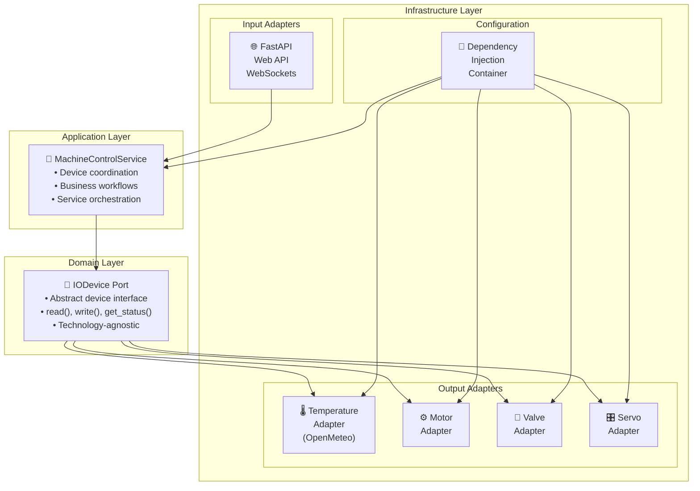

# Machine Control Panel

[](https://python.org)
[](https://reactjs.org/)
[](https://fastapi.tiangolo.com/)
[](https://www.typescriptlang.org/)

Full-stack industrial IoT control system with real-time device monitoring via WebSocket. **Monorepo** containing Python FastAPI backend (`apps/backend`) and React TypeScript frontend (`apps/webapp`) with hexagonal architecture, real-time temperature from OpenMeteo API, and responsive controls.

## 🚀 Quick Start

### Prerequisites
- **Python 3.13+** with Poetry
- **Node.js 18+** with npm

### Run the Complete System

1. **Clone and navigate**
   ```bash
   git clone <repository-url>
   cd machine-control-system
   ```

2. **Start Backend** (Terminal 1)
   ```bash
   cd apps/backend
   poetry install
   poetry run uvicorn src.infrastructure.api.main:app --reload
   ```
   Backend API: http://localhost:8000/docs

3. **Start Frontend** (Terminal 2)
   ```bash
   cd apps/webapp
   npm install
   npm run dev
   ```
   Dashboard: http://localhost:5173

### Core Features
- 🌡️ **Real-time Temperature**: OpenMeteo API integration (not simulated)
- ⚙️ **Motor Control**: 0-255 PWM with RPM conversion (0-40000)
- 🔧 **Valve Control**: Binary open/closed with animations
- 🎛️ **Servo Control**: 0-180° positioning with integer validation
- 📡 **WebSocket Real-time**: Bi-directional updates with auto-reconnect

## 🏗️ Architecture

This project implements a **Simplified Hexagonal Architecture** with clear separation of concerns:



**Architecture Layers:**
- **Domain**: Device abstractions (IODevice interface)
- **Application**: Business workflows (MachineControlService)  
- **Infrastructure**: External integrations (FastAPI, OpenMeteo, WebSockets)

## 🛠️ Development

### Testing
```bash
# Backend tests
cd apps/backend && poetry run pytest --cov=src

# Frontend build 
cd apps/webapp && npm run build
```

## 📁 Project Structure

```
machine-control-system/
├── README.md                          # Project documentation
├── CLAUDE.md                         # AI assistant configuration
└── apps/
    ├── backend/                       # Python FastAPI Backend
    │   ├── pyproject.toml            # Poetry configuration
    │   ├── config/
    │   │   └── devices.yaml          # Device configuration  
    │   ├── docs/                     # Architecture Decision Records
    │   ├── src/
    │   │   ├── domain/               # Core business logic
    │   │   │   └── ports/
    │   │   │       └── io_device.py  # Device abstraction
    │   │   ├── application/          # Business workflows
    │   │   │   └── machine_service.py # Device coordination
    │   │   └── infrastructure/       # External integrations
    │   │       ├── adapters/         # Device implementations
    │   │       ├── di/              # Dependency injection
    │   │       └── api/             # FastAPI web layer
    │   │           ├── main.py      # Application entry point
    │   │           ├── routers/     # REST API endpoints
    │   │           ├── models/      # Request/Response models
    │   │           ├── dependencies.py # DI integration
    │   │           └── websockets/  # WebSocket endpoints
    │   └── tests/                   # Backend test suite
    └── webapp/                      # React TypeScript Frontend
        ├── package.json            # npm configuration
        ├── vite.config.ts         # Vite build configuration
        ├── tailwind.config.js     # Tailwind CSS configuration
        ├── docs/                  # Frontend ADRs
        │   ├── ADR-001-frontend-stack.md
        │   └── ADR-002-component-architecture.md
        └── src/
            ├── components/        # React components
            │   ├── ui/           # Reusable UI components
            │   ├── layout/       # Layout components  
            │   └── devices/      # Device-specific components
            ├── hooks/            # Custom React hooks
            ├── services/         # API integration layer
            │   └── api/          # REST and WebSocket clients
            ├── store/            # Zustand state management
            ├── types/            # TypeScript definitions
            ├── config/           # Configuration constants
            └── utils/            # Utility functions
```

## 🎯 Device Details

| Device | Type | Range | API Endpoint | Features |
|--------|------|-------|--------------|----------|
| 🌡️ **Temperature** | Read-only | Real-time | `GET /devices/temp_sensor_01` | OpenMeteo API, 2min polling |
| ⚙️ **Motor** | Control | 0-255 PWM | `POST /devices/motor_01` | Speed simulation, RPM display |
| 🔧 **Valve** | Control | Open/Closed | `POST /devices/valve_01` | Binary state, visual feedback |
| 🎛️ **Servo** | Control | 0-180° | `POST /devices/servo_01` | Integer angles, precise positioning |

## 💻 Tech Stack

**Backend:** Python 3.13 + FastAPI + WebSockets + Poetry + Pytest  
**Frontend:** React 18 + TypeScript 5 + Tailwind CSS + Zustand + Vite  
**Architecture:** Hexagonal (Ports & Adapters) + Dependency Injection  
**Real-time:** WebSocket bi-directional communication with auto-reconnect  
**External API:** OpenMeteo for real temperature data (not simulated)

## ✅ Implementation Highlights

**Core Requirements Met:**
- ✅ **Python Backend** with FastAPI + hexagonal architecture
- ✅ **React Frontend** with TypeScript + responsive design  
- ✅ **Real Temperature API** - OpenMeteo integration (not simulated)
- ✅ **Motor Control** - PWM speed with RPM display (0-255 → 0-40000)
- ✅ **Valve Control** - Binary open/closed with visual feedback

**Extra Features Added:**
- ✅ **Servo Motor** - 0-180° positioning with integer validation
- ✅ **WebSocket Real-time** - Bi-directional updates with auto-reconnect
- ✅ **Optimistic UI** - Immediate feedback with rollback on errors
- ✅ **Mobile Responsive** - Touch-friendly controls for all devices
- ✅ **Professional Documentation** - ADRs + Mermaid diagrams

---

**Built with Python FastAPI + React TypeScript using hexagonal architecture principles.**