# Machine Control Backend

[](https://python.org)
[](https://fastapi.tiangolo.com/)
[](https://python-poetry.org/)
[](https://alistair.cockburn.us/hexagonal-architecture/)

Industrial IoT backend system built with **FastAPI** and **Hexagonal Architecture** principles. Provides real-time device monitoring, control capabilities, and WebSocket streaming for industrial automation systems.

## 🏗️ Architecture Overview

This backend implements a **Simplified Hexagonal Architecture** (Ports & Adapters) with clean separation of concerns:

### Core Principles

- **🎯 Domain-Driven Design** - Business logic isolated from infrastructure concerns
- **🔌 Ports & Adapters** - Technology-agnostic interfaces with concrete implementations
- **💉 Dependency Injection** - Loose coupling through container-based DI
- **🚀 Service Layer** - Application orchestration and workflow management
- **🧪 Test-Driven Development** - Comprehensive testing with mocking strategies

### Architecture Layers

```mermaid
graph TB
    subgraph "🔌 Infrastructure Layer"
        subgraph "Input Adapters"
            FastAPI["🌐 FastAPI<br/>REST API<br/>WebSockets"]
        end
        
        subgraph "Output Adapters"
            TempAdapter["🌡️ Temperature Adapter<br/>(OpenMeteo API)"]
            MotorAdapter["⚙️ Motor Adapter<br/>(Simulation)"]
            ValveAdapter["🔧 Valve Adapter<br/>(Binary Control)"]
            ServoAdapter["🎛️ Servo Adapter<br/>(Position Control)"]
        end
        
        subgraph "Configuration"
            DIContainer["💉 Dependency<br/>Injection Container"]
        end
    end
    
    subgraph "🚀 Application Layer"
        MachineService["MachineControlService<br/>• Device coordination<br/>• Business workflows<br/>• Service orchestration"]
    end
    
    subgraph "🎯 Domain Layer"
        IODevice["IODevice Port<br/>• Abstract device interface<br/>• read(), write(), get_status()<br/>• Technology-agnostic operations"]
    end
    
    FastAPI --> MachineService
    MachineService --> IODevice
    IODevice -.-> TempAdapter
    IODevice -.-> MotorAdapter
    IODevice -.-> ValveAdapter
    IODevice -.-> ServoAdapter
    DIContainer --> MachineService
    DIContainer --> TempAdapter
    DIContainer --> MotorAdapter
    DIContainer --> ValveAdapter
    DIContainer --> ServoAdapter
```



## 🚀 Quick Start

### Prerequisites

- **Python 3.13+**
- **Poetry** for dependency management

### Installation & Setup

1. **Navigate to backend directory**
   ```bash
   cd apps/backend
   ```

2. **Install dependencies**
   ```bash
   poetry install
   ```

3. **Activate virtual environment**
   ```bash
   poetry shell
   ```

4. **Start the server**
   ```bash
   # Development with auto-reload
   poetry run uvicorn src.infrastructure.api.main:app --reload
   
   # Production-like setup
   poetry run uvicorn src.infrastructure.api.main:app --host 0.0.0.0 --port 8000
   ```

### 🌐 API Endpoints

Once running, the following endpoints are available:

- **📊 API Documentation**: http://localhost:8000/docs
- **📋 Alternative Docs**: http://localhost:8000/redoc  
- **💓 Health Check**: http://localhost:8000/health
- **🎛️ Device Control**: http://localhost:8000/api/v1/devices/
- **📡 WebSocket**: ws://localhost:8000/ws/devices

## 🔧 Supported Devices

### 🌡️ Temperature Sensor
- **Integration**: OpenMeteo API for real environmental data
- **Endpoint**: `GET /api/v1/devices/temp_sensor_01`
- **Features**: Read-only sensor with geographic location support
- **Rate Limiting**: Optimized 2-minute intervals for free API tier

### ⚙️ Motor Control  
- **Range**: 0-255 PWM speed control
- **Endpoint**: `POST /api/v1/devices/motor_01 {"speed": 128}`
- **Features**: Realistic acceleration simulation, status feedback
- **Safety**: Built-in limits and error conditions

### 🔧 Valve Management
- **States**: Binary open/closed control  
- **Endpoint**: `POST /api/v1/devices/valve_01 {"state": true}`
- **Features**: Position confirmation, transition status
- **Safety**: Fail-safe modes and timeout protection

### 🎛️ Servo Control
- **Range**: 0-180° position control (integer values only)
- **Endpoint**: `POST /api/v1/devices/servo_01 {"angle": 90}`
- **Features**: High-precision positioning, movement status
- **Calibration**: Self-calibration and limit detection

## 📁 Project Structure

```
apps/backend/
├── README.md                          # This file
├── pyproject.toml                     # Poetry configuration
├── config/
│   └── devices.yaml                   # Device configuration
├── docs/                              # Architecture Decision Records
│   ├── ADR-001-architecture.md        # Hexagonal architecture rationale
│   ├── ADR-002-documentation.md       # Documentation standards
│   ├── ADR-003-dependency-injection.md # DI patterns
│   └── ADR-004-web-api-layer.md       # FastAPI integration
├── src/
│   ├── domain/                        # 🎯 Core Business Logic
│   │   └── ports/
│   │       └── io_device.py           # Device abstraction interface
│   ├── application/                   # 🚀 Business Workflows  
│   │   └── machine_service.py         # Device coordination service
│   └── infrastructure/                # 🔌 External Integrations
│       ├── adapters/                  # Device implementations
│       │   ├── temperature_adapter.py # OpenMeteo API integration
│       │   ├── motor_adapter.py       # Motor control simulation
│       │   ├── valve_adapter.py       # Valve state management
│       │   └── servo_adapter.py       # Servo position control
│       ├── di/                        # Dependency injection setup
│       │   ├── containers.py          # DI container configuration
│       │   └── factory.py             # Container factory
│       └── api/                       # 🌐 FastAPI Web Layer
│           ├── main.py                # Application entry point
│           ├── dependencies.py        # DI integration
│           ├── routers/               # REST API endpoints
│           │   └── devices.py         # Device control routes
│           ├── models/                # Pydantic models
│           │   ├── requests.py        # Request validation models
│           │   └── responses.py       # Response models
│           └── websockets/            # Real-time communication
│               └── endpoints.py       # WebSocket handlers
└── tests/                             # 🧪 Comprehensive Test Suite
    ├── domain/                        # Domain layer tests
    ├── application/                   # Application layer tests
    └── infrastructure/                # Infrastructure layer tests
```

## 🧪 Testing

### Run Tests

```bash
# Run all tests
poetry run pytest

# Run with coverage report
poetry run pytest --cov=src --cov-report=html

# Run specific test file
poetry run pytest tests/domain/test_io_device.py

# Run integration tests
poetry run pytest tests/infrastructure/
```

### Testing Strategy

- **✅ Unit Tests**: Isolated testing for each layer
- **🔗 Integration Tests**: Device adapter validation with HTTP mocking  
- **⚡ Async Testing**: Full async/await pattern coverage
- **🎭 Mock Strategies**: Proper external dependency isolation
- **📊 Coverage Analysis**: Focus on business logic, exclude DI configuration

## 🔌 API Integration

### Generic Device Control

All devices use a unified control interface:

```python
# Motor control
POST /api/v1/devices/motor_01
{"speed": 128}  # 0-255

# Servo control  
POST /api/v1/devices/servo_01
{"angle": 90}   # 0-180 (integers only)

# Valve control
POST /api/v1/devices/valve_01  
{"state": true} # true=open, false=closed

# Get device status
GET /api/v1/devices/motor_01

# List all devices
GET /api/v1/devices/
```

### WebSocket Real-time Updates

```javascript
// Connect to WebSocket
const ws = new WebSocket('ws://localhost:8000/ws/devices?client_id=webapp');

// Receive device updates
ws.onmessage = (event) => {
  const update = JSON.parse(event.data);
  console.log(`Device ${update.device_id} changed:`, update);
};
```

## 🛠️ Development

### Code Style & Standards

- **📝 Docstrings**: Google-style documentation for all functions
- **🔒 Type Hints**: Full type annotation coverage
- **⚡ Async/Await**: Consistent asynchronous programming patterns
- **🧹 Code Quality**: Follows PEP 8 and best practices

### Adding New Device Types

1. **Create Device Adapter** in `src/infrastructure/adapters/`
2. **Implement IODevice Interface** with required methods
3. **Register in DI Container** (`src/infrastructure/di/containers.py`)
4. **Add Device Configuration** in `config/devices.yaml`
5. **Create Tests** in `tests/infrastructure/adapters/`

### Environment Configuration

The application uses dependency injection for configuration. Device settings are managed in `config/devices.yaml`:

```yaml
devices:
  temperature:
    device_id: "temp_sensor_01"
    coordinates: [40.7128, -74.0060]  # NYC coordinates
  
  motor:
    device_id: "motor_01"
    max_speed: 255
  
  # ... additional device configurations
```

## 📋 Key Features

- ✅ **Hexagonal Architecture** - Clean separation of concerns
- ✅ **FastAPI Integration** - Modern Python web framework
- ✅ **Real-time WebSockets** - Live device state streaming  
- ✅ **Dependency Injection** - Loosely coupled, testable components
- ✅ **OpenAPI Documentation** - Auto-generated API docs
- ✅ **CORS Support** - Frontend integration ready
- ✅ **Error Handling** - Comprehensive validation and error responses
- ✅ **Async/Await** - High-performance asynchronous operations
- ✅ **Device Abstraction** - Generic interface for all device types
- ✅ **External API Integration** - OpenMeteo weather data

## 🚀 Deployment

### Production Setup

```bash
# Install production dependencies
poetry install --only=main

# Run with Gunicorn + Uvicorn workers
poetry run gunicorn src.infrastructure.api.main:app -w 4 -k uvicorn.workers.UvicornWorker
```

### Docker Support

```dockerfile
FROM python:3.13-slim
WORKDIR /app
COPY pyproject.toml poetry.lock ./
RUN pip install poetry && poetry install --only=main
COPY . .
CMD ["poetry", "run", "uvicorn", "src.infrastructure.api.main:app", "--host", "0.0.0.0"]
```

## 🤝 Contributing

1. Follow hexagonal architecture principles
2. Maintain comprehensive test coverage (>90%)
3. Document architectural decisions in ADRs
4. Use Google-style docstrings
5. Ensure full async/await compatibility
6. Follow conventional commits for messages

---

**Built with ❤️ using Python 3.13, FastAPI, and Hexagonal Architecture principles.**